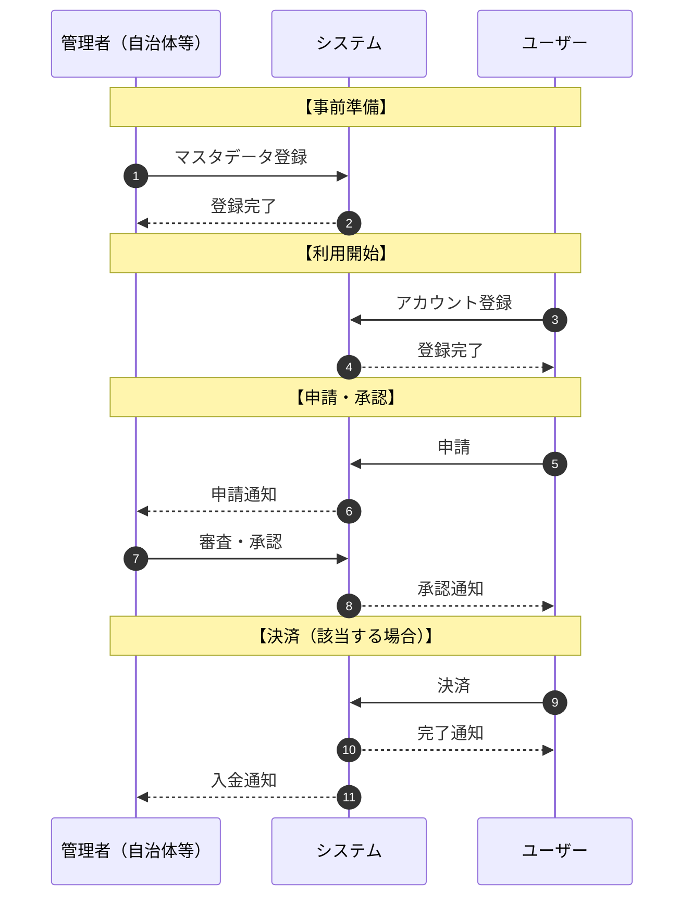

# ビジネス分析

> ISO/IEC/IEEE 15288: Business or Mission Analysis (6.4.1)

## サービスフロー概要

※ 上記は汎用テンプレートです。案件に合わせて登場人物・フローを修正してください。

---

## 基本情報
| 項目 | 内容 |
|------|------|
| プロジェクト名 | |
| クライアント | |
| 初回ヒアリング日 | |
| 担当者 | |

## 現状 (As-Is)
### 業務の現状
-

### 現在抱えている課題
| 課題ID | 課題内容 | 影響 | 関係者 |
|--------|----------|------|--------|
| P-001 | | | |

### 現行システム/ツール
-

## 理想 (To-Be)
### あるべき姿
-

### 実現したい価値
| 価値ID | 内容 | 受益者 | 関連課題 |
|--------|------|--------|----------|
| V-001 | | | P-001 |

## ギャップ分析
### 現状と理想の差分
| ギャップID | 現状 | 理想 | 埋めるために必要なこと |
|------------|------|------|------------------------|
| G-001 | | | |

### 優先度判定
| ギャップID | ビジネス価値 | 実現難易度 | 優先度 |
|------------|-------------|-----------|--------|
| G-001 | High/Mid/Low | High/Mid/Low | 1 |

## 投資対効果 (ROI)
### 定量効果
| 効果 | 現状 | 改善後 | 削減/向上 |
|------|------|--------|----------|
| 例: 作業時間 | 10時間/週 | 2時間/週 | 8時間削減 |

### 定性効果
-

### 投資回収見込み
- 初期投資:
- 月間コスト:
- 回収期間:

## Why Us（なぜ私たちか）
### 強み
-

### 類似実績
-

### 提供できる価値
-

## 参照資料
- [ ] 0_input/依頼メモ
- [ ] 0_input/MTG議事録

## 次のステップ
- [ ] ステークホルダー要求の整理へ進む
